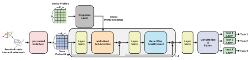

# Ditto
Ditto: deep multi-task learning with modeling gene interaction using transformer for predicting multiple clinical features in patients

<p align="center">
	
</p>

## Environment
Install `conda` environment.
```
conda env create -f environment.yaml
```
